# Documentation

Project documentation for ThoughtFlow.

## Contents

Documentation will be added as the project develops, including:

- Architecture and design decisions
- API specifications and interfaces

# analyzer.ts - Code Logic & Flow

## Overview

This module (`analyzer.ts`) implements a **custom Call Hierarchy Provider** for **Python** in **Visual Studio Code**, using **regex and indentation analysis** to determine:

- **Incoming calls** (who calls a function)
- **Outgoing calls** (what functions a function calls)

It is **lightweight**, **self-contained**, and **requires no external parser**.

---

## Core Entry Point

```ts
export async function getCallHierarchy(
    document: vscode.TextDocument,
    position: vscode.Position
)
```

### Flow Summary

1. **Create cancellation token** → supports timeout/cancel
2. **Prepare target symbol** → `prepareCallHierarchy()`
3. **Get incoming calls** → `provideCallHierarchyIncomingCalls()`
4. **Get outgoing calls** → `provideCallHierarchyOutgoingCalls()`
5. **Return structured result** or `null`

```ts
{
    function: CallHierarchyItem,
    callers: CallHierarchyIncomingCall[],
    callees: CallHierarchyOutgoingCall[]
}
```

---

## 1. `prepareCallHierarchy()`

**Goal**: Identify the symbol under the cursor.

### Logic Flow

```mermaid
graph TD
    A[Get word at cursor] --> B{Word exists?}
    B -- No --> C[Return undefined]
    B -- Yes --> D[Check current line: def pattern?]
    D -- Yes --> E[Match def func_name(?]
    E -- Name matches word? --> F[Yes: Return item for definition]
    E -- No --> G[Return item for call site]
    D -- No --> G
```

### Key Patterns

- **Definition**: `/^\s*def\s+([A-Za-z_][A-Za-z0-9_]*)\s*\(/`
- **Call site fallback**: Any word under cursor → treated as function

> Returns `CallHierarchyItem` with:
> - `SymbolKind.Function`
> - Correct `uri`, `range`, `selectionRange`

---

## 2. `provideCallHierarchyIncomingCalls()`

**Goal**: Find **all calls to `targetName`** across workspace.

### Step-by-Step Algorithm

| Step | Action |
|------|-------|
| 1 | Find all `.py` files (exclude `node_modules`) |
| 2 | For each file: |
|   2.1 | Build **function definition map** using indentation |
|   2.2 | Regex search: `\btargetName\s*\(` |
|   2.3 | **Skip**: definition lines (`def targetName(`) |
|   2.4 | **Skip**: recursive self-calls |
|   2.5 | Map call line → containing function |
|   2.6 | Create `CallHierarchyIncomingCall` |

### Function Boundary Detection

```ts
indent = position of first non-whitespace in "def" line
while next line has indent > def_indent → still in function
```

- Handles nested functions
- Correctly identifies module-level calls (`<module>`)

### Filters

| Filter | Purpose |
|------|--------|
| `defLinePattern` | Avoid counting `def foo(` as a call |
| `caller === targetName` | Skip recursion (e.g., `factorial` → `factorial`) |

---

## 3. `provideCallHierarchyOutgoingCalls()`

**Goal**: Find **all function calls inside the target function's body**.

### Step-by-Step Algorithm

| Step | Action |
|------|-------|
| 1 | Locate `def` line (search up/down if needed) |
| 2 | Measure `defIndent` |
| 3 | Find first non-empty line after `def` → `bodyStart` |
| 4 | Measure `bodyIndent` (must be > `defIndent`) |
| 5 | Walk lines until indent drops below `bodyIndent` → `bodyEnd` |
| 6 | Extract `bodyText` |
| 7 | Regex: `/[A-Za-z_][A-Za-z0-9_]*\s*\(/g` |
| 8 | **Skip self-calls** |
| 9 | Create `CallHierarchyOutgoingCall` |

### Body Extraction Example

```python
  def calculate(x):
      a = add(x, 1)
      return mul(a, 2)
```

- `defIndent` = 2
- `bodyIndent` = 6
- Body: lines with indent ≥ 6
- Extracted text scanned for `add(`, `mul(`

---

## Helper: `escapeRegExp(str)`

**Purpose**: Safely use function names in regex.

```ts
escapeRegExp("my.func") → "my\\.func"
```

Prevents:
- `.` → any char
- `(` → grouping
- `*` → zero or more

Used in **both incoming and outgoing** call detection.

---

## Data Flow Diagram

```mermaid
graph LR
    UserClick --> getCallHierarchy
    getCallHierarchy --> prepareCallHierarchy
    prepareCallHierarchy --> targetItem
    targetItem --> incomingProvider
    targetItem --> outgoingProvider

    incomingProvider --> WorkspaceScan
    WorkspaceScan --> FileLoop
    FileLoop --> BuildDefMap
    BuildDefMap --> RegexCalls
    RegexCalls --> FilterDefLines
    FilterDefLines --> FilterRecursion
    FilterRecursion --> MapToCaller
    MapToCaller --> incomingResults

    outgoingProvider --> FindDefLine
    FindDefLine --> MeasureIndent
    MeasureIndent --> ExtractBody
    ExtractBody --> RegexCallsInBody
    RegexCallsInBody --> FilterSelf
    FilterSelf --> outgoingResults

    incomingResults --> FinalResult
    outgoingResults --> FinalResult
```



---

## Key Design Decisions

| Decision | Reason |
|--------|--------|
| **Regex + Indentation** | Fast, no AST parser needed |
| **Skip self-calls** | Avoid clutter in call graph |
| **Fallback to call site** | Works even if cursor not on `def` |
| **Cancellation token** | Prevent hangs on large codebases |
| **Module-level = `<module>`** | Clear distinction from functions |

---

## Limitations (by Design)

| Limitation | Cause |
|----------|-------|
| False positives in strings | `"call add()" → matched` |
| No import alias resolution | `from lib import x as y` → `y()` not linked |
| No dynamic calls | `getattr(obj, "method")()` ignored |
| No class method support | `self.method()` not distinguished |

---

## Summary: Call Graph Construction

```ts
Call Graph = {
  node: targetFunction
  edges_in:  [caller → target]
  edges_out: [target → callee]
}
```

Built via:
- **Incoming**: Global regex search + containment analysis
- **Outgoing**: Local body scan + indentation boundary

**No external tools. No LSP. Pure VS Code API.**

--- 

*Fast, accurate enough, and fully local.*